Demand\_Forecast
================
Esad Demirel

***PAKETLERİ YÜKLEME***

\#library(readxl) \#library(dplyr) \#library(tidyverse)
\#library(outliers) \#library(lubridate) \#library(RColorBrewer)
\#library(ggplot2) \#library(rstatix) \#library(fpp2) \#library(TTR)
\#library(forecast)

***VERİ OKUTMA***

(Müşteri no, Satış tarihi, Ürün no, Satış adedi, Sipariş no ve Satış
tarihinin hangi yıl-ay içinde yapıldığını gösteren bir verimiz var. Biz
daha çok Zaman Serisi Analizi üzerinden tarihleri ve bağlı satış
adetlerini inceleyeceğiz.)

``` r
tt <- read.csv("taleptahmin.csv")
head(tt)
```

    ##   Customer.Account  SalesDate Product.Number Sales.Quantity Order.number
    ## 1        Cust00001 2014-01-06        PRD0001           2600    Order0001
    ## 2        Cust00001 2014-01-06        PRD0002            200    Order0001
    ## 3        Cust00001 2014-01-06        PRD0003            800    Order0001
    ## 4        Cust00001 2014-01-06        PRD0004            800    Order0001
    ## 5        Cust00002 2014-03-05        PRD0003           2400    Order0002
    ## 6        Cust00002 2014-03-05        PRD0002            600    Order0002
    ##    Period
    ## 1 2014-01
    ## 2 2014-01
    ## 3 2014-01
    ## 4 2014-01
    ## 5 2014-03
    ## 6 2014-03

``` r
nrow(tt) # satir kontrolu
```

    ## [1] 156631

``` r
str(tt) 
```

    ## 'data.frame':    156631 obs. of  6 variables:
    ##  $ Customer.Account: chr  "Cust00001" "Cust00001" "Cust00001" "Cust00001" ...
    ##  $ SalesDate       : chr  "2014-01-06" "2014-01-06" "2014-01-06" "2014-01-06" ...
    ##  $ Product.Number  : chr  "PRD0001" "PRD0002" "PRD0003" "PRD0004" ...
    ##  $ Sales.Quantity  : num  2600 200 800 800 2400 600 800 1050 600 1200 ...
    ##  $ Order.number    : chr  "Order0001" "Order0001" "Order0001" "Order0001" ...
    ##  $ Period          : chr  "2014-01" "2014-01" "2014-01" "2014-01" ...

``` r
class(tt)
```

    ## [1] "data.frame"

``` r
names(tt) 
```

    ## [1] "Customer.Account" "SalesDate"        "Product.Number"   "Sales.Quantity"  
    ## [5] "Order.number"     "Period"

``` r
summary(tt)
```

    ##  Customer.Account    SalesDate         Product.Number     Sales.Quantity    
    ##  Length:156631      Length:156631      Length:156631      Min.   :-30000.0  
    ##  Class :character   Class :character   Class :character   1st Qu.:    30.0  
    ##  Mode  :character   Mode  :character   Mode  :character   Median :    99.0  
    ##                                                           Mean   :   507.9  
    ##                                                           3rd Qu.:   240.0  
    ##                                                           Max.   : 99000.0  
    ##  Order.number          Period         
    ##  Length:156631      Length:156631     
    ##  Class :character   Class :character  
    ##  Mode  :character   Mode  :character  
    ##                                       
    ##                                       
    ## 

DEĞİŞKEN İSİMLERİNİ DÜZENLEME

``` r
names(tt) <- c("CustomerAccount", "SalesDate", "ProductNumber", "SalesQuantity", "OrderNumber", "Period")
names(tt)
```

    ## [1] "CustomerAccount" "SalesDate"       "ProductNumber"   "SalesQuantity"  
    ## [5] "OrderNumber"     "Period"

TARİH DEĞİŞKENİNİ DATE YAPMA

(Excelden alinan veride kolon genel olarak kaydedilmiştir. Üzerinde
tarih işlemleri yapabilmek için as.Date ile tipini düzeltiyoruz.)

``` r
tt$SalesDate <- as.Date(tt$SalesDate)
str(tt$SalesDate)
```

    ##  Date[1:156631], format: "2014-01-06" "2014-01-06" "2014-01-06" "2014-01-06" "2014-03-05" ...

HİSTOGRAM GRAFİĞİ

``` r
hist(tt$SalesQuantity,
     breaks = 200,
     xlim = c(-1000,5000),
     col = c("#d35400" , "#2c3e50" , "#16a085"), #flatuicolors.com dan renk aldik 
     prob = T) 
```

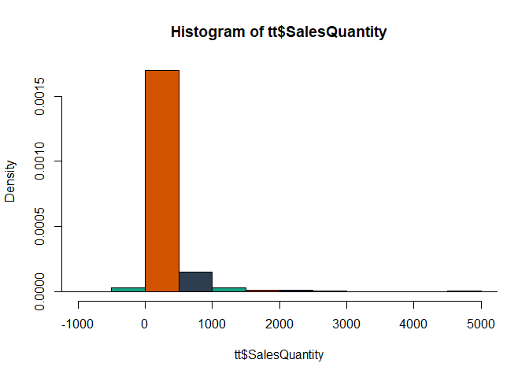<!-- -->

ÜRÜN NUMARALARINA GÖRE SATIŞ ADETLERİ

(Bir ürün üzerinden tahmin yapacağız. En fazla veri satırına sahip
veriyi bulmak için table() kullanıyoruz. )

``` r
toplam <- tt %>%
  group_by(ProductNumber)%>%
  summarize(Toplam_Satis = sum(SalesQuantity))
```

    ## `summarise()` ungrouping output (override with `.groups` argument)

``` r
head(toplam)
```

    ## # A tibble: 6 x 2
    ##   ProductNumber Toplam_Satis
    ##   <chr>                <dbl>
    ## 1 PRA0134            326525.
    ## 2 PRA0135            675470.
    ## 3 PRA0136            165971.
    ## 4 PRA0137            590569.
    ## 5 PRA0138           2660543.
    ## 6 PRA0139            516135.

``` r
table(tt$ProductNumber)
```

    ## 
    ## PRA0134 PRA0135 PRA0136 PRA0137 PRA0138 PRA0139 PRA0140 PRA0141 PRA0142 PRA0143 
    ##     234    1324     453     912    2455     899    1303    2144     806    1478 
    ## PRA0144 PRA0145 PRA0146 PRA0147 PRA0148 PRA0149 PRA0150 PRA0151 PRA0152 PRA0153 
    ##     118     384    1482      67     186     308      81     168     329      39 
    ## PRA0154 PRA0155 PRA0156 PRD0001 PRD0002 PRD0003 PRD0004 PRD0005 PRD0006 PRD0007 
    ##      45     529      85    5974    6465    6670    1357      66     594    2325 
    ## PRD0008 PRD0009 PRD0010 PRD0011 PRD0012 PRD0013 PRD0014 PRD0015 PRD0016 PRD0017 
    ##    4894    2491    2047     932    1498    2007     862     762     573     364 
    ## PRD0018 PRD0019 PRD0020 PRD0021 PRD0022 PRD0023 PRD0024 PRD0025 PRD0026 PRD0027 
    ##     339    2386     411   11114    4894    2496    4027    2524    1357    1612 
    ## PRD0028 PRD0029 PRD0030 PRD0031 PRD0032 PRD0033 PRD0034 PRD0035 PRD0036 PRD0037 
    ##    1066     346     165     748      16    1320    1546      83     645    2363 
    ## PRD0038 PRD0039 PRD0040 PRD0041 PRD0042 PRD0043 PRD0044 PRD0045 PRD0046 PRD0047 
    ##     885    1794    2298    1050    1124    1603     527      69    1229     552 
    ## PRD0048 PRD0049 PRD0050 PRD0051 PRD0052 PRD0053 PRD0054 PRD0055 PRD0056 PRD0057 
    ##     717    1634    3179    2211     188      43      90     314    1246      68 
    ## PRD0058 PRD0059 PRD0060 PRD0061 PRD0062 PRD0063 PRD0064 PRD0065 PRD0066 PRD0067 
    ##     319     685      49      56    1515     273    1075     191     373     914 
    ## PRD0068 PRD0069 PRD0070 PRD0071 PRD0072 PRD0073 PRD0074 PRD0075 PRD0076 PRD0077 
    ##     170     477     462     285     642     851    3321    1161      15     143 
    ## PRD0078 PRD0079 PRD0080 PRD0081 PRD0082 PRD0083 PRD0084 PRD0085 PRD0086 PRD0087 
    ##     409     851     345     609    2328    1407      36     182     139     705 
    ## PRD0088 PRD0089 PRD0090 PRD0091 PRD0092 PRD0093 PRD0094 PRD0095 PRD0096 PRD0097 
    ##     646    1168      93     576    1069     936     393      93     171      84 
    ## PRD0098 PRD0099 PRD0100 PRD0101 PRD0102 PRD0103 PRD0104 PRD0105 PRD0106 PRD0107 
    ##     231    1847     420     730     105     291     181     757    1497    1134 
    ## PRD0108 PRD0109 PRD0110 PRD0111 PRD0112 PRD0113 PRD0114 PRD0115 PRD0116 PRD0117 
    ##     880    1065    1361      72       6      56     335     473     304    1250 
    ## PRD0118 PRD0119 PRD0120 PRD0121 PRD0122 PRD0123 PRD0124 PRD0125 PRD0126 PRD0127 
    ##      90     479      93      31       6      96      31     198     486       4 
    ## PRD0128 PRD0129 PRD0130 PRD0131 PRD0132 PRD0133 
    ##     181     135       3     541      55       1

***NEGATİF VERİ KONTROLÜ***

(Satış adedi negatif olamayacağı için bu verileri giriş hatası olarak
kabul ederek verisetinden çıkarıyoruz.)

``` r
tt2 <- tt %>%
  filter(SalesQuantity >= 0 , na.rm = TRUE)
```

``` r
nrow(tt2)  #153688 satir veri
```

    ## [1] 153688

``` r
tt_negatif <- tt %>%
  filter(SalesQuantity < 0 , na.rm = TRUE)
nrow(tt_negatif)  #2943 satir veri
```

    ## [1] 2943

***AYKIRI DEĞER KONTROLÜ***

(Veri setimizde şirketin normalde gerçekleştirmediği çok uçuk satış
adetleri girilmiştir. Kullanıcı hatası olabilir. Tahminleme modeli
üzerine çalıştığımız için daha yakın, gerçekçi verilerle çalışmamız
gerekir. Bizi yanıltabilecek verileri ayıklamalıyız. Bunun için iki
yöntemi inceliyoruz.)

Z değeri ile Aykırı Değer Kontrolü

``` r
#install.packages("outliers")
#library(outliers)
```

``` r
tt2_outliers <- scores(na.omit(tt2$SalesQuantity), type = "z" , prob = 0.95)
idst1 <- which(tt2_outliers == TRUE)
```

``` r
head(na.omit(tt2$SalesQuantity)[idst1]) #1178 satir veri
```

    ## [1] 12000 12000  6000  7000 18000  6000

``` r
min(na.omit(tt2$SalesQuantity)[idst1]) #5500
```

    ## [1] 5500

``` r
max(na.omit(tt2$SalesQuantity)[idst1]) #99000
```

    ## [1] 99000

(Görüldüğü üzere z değerine göre yapılan analizde, 5500 adetten yukarıda
olan satış adetleri aykırı değer olarak belirtildi.)

``` r
par(mfrow = c(2,1)) # plot ekranını bölme
hist(tt2$SalesQuantity, breaks = 50, xlim = c(0,30000), ylim = c(0,1500))
hist(na.omit(tt2$SalesQuantity)[-idst1], breaks = 50, xlim = c(0,30000), ylim = c(0,1500))# aykırı değerler çıkartılınca
```

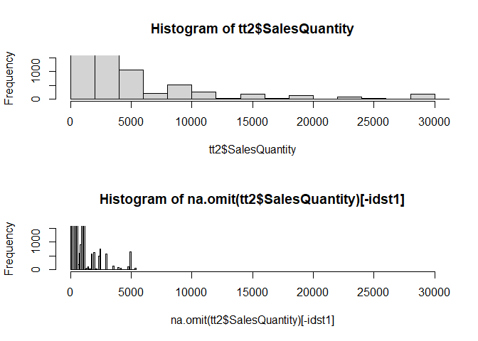<!-- -->

Boxplot Yöntemine Göre Aykırı Değer Kontrolü

``` r
#library(rstatix)
```

``` r
tt2_outliers2 <- identify_outliers(tt2[ "SalesQuantity"]) 
nrow(tt2_outliers2) #20938 satir veri 
```

    ## [1] 20938

``` r
min(tt2_outliers2[, "SalesQuantity"]) #539
```

    ## [1] 539

``` r
max(tt2_outliers2[, "SalesQuantity"]) #99000
```

    ## [1] 99000

``` r
idst2 <- which(tt2_outliers2$is.extreme == TRUE)
extreme <- tt2_outliers2[idst2 , "SalesQuantity"]

min(extreme) #820
```

    ## [1] 820

``` r
max(extreme) #99000
```

    ## [1] 99000

``` r
length(extreme)#13005 satir veri
```

    ## [1] 13005

(Boxplot yöntemine göre aykırı değerler iki farklı gruba ayrıldı. Aykırı
değerler ve extreme aykırı değerler. 20938 satır veri aykırı değer
olarak algılanırken 13005 satır veri ekstreme aykırı değer olarak
belirtildi. Extreme olan aykırı değerlerin minimumu ise 820. 820
şirketin normal olarak alabildiği bir sipariş adedi olduğu için boxplot
yöntemi tercih edilmemiştir.)

***KAYIP DEĞER KONTROLÜ***

``` r
idst3 <- which(is.na(tt2)) 
idst3 # na değeri yok
```

    ## integer(0)

``` r
nrow(tt2)#153688
```

    ## [1] 153688

AYKIRI DEĞERLERİ VERİSETİNDEN ÇIKARTMA

``` r
tt3 <- tt2[-idst1 , ] #aykiri deger bulunan satirlari cikartma
nrow(tt3)#151510
```

    ## [1] 151510

TAMSAYI KONTROLÜ

(Satış adedimiz ondalıklı olamayacağı için veri setinde ondalıklı olarak
bulunan satış adetleri giriş hatası olarak belirtilerek çıkarılmıştır.)

``` r
tamsayi <- which(tt3$SalesQuantity %% 1 > 0)
head(tt3[tamsayi, ]) 
```

    ##      CustomerAccount  SalesDate ProductNumber SalesQuantity OrderNumber  Period
    ## 546        Cust00103 2014-01-07       PRD0054           1.5   Order0314 2014-01
    ## 753        Cust00174 2014-01-09       PRD0054           0.5   Order0469 2014-01
    ## 943        Cust00052 2014-01-13       PRD0057           0.5   Order0578 2014-01
    ## 998        Cust00047 2014-01-13       PRD0001         174.5   Order0620 2014-01
    ## 1059       Cust00044 2014-01-14       PRD0057           0.1   Order0644 2014-01
    ## 1089       Cust00041 2014-01-14       PRD0008           0.1   Order0661 2014-01

``` r
nrow(tt3[tamsayi, ])#587 ondalikli satis adedi
```

    ## [1] 587

``` r
tt4 <- tt3[-tamsayi, ] #ondalikli degerleri cikartma
nrow(tt4)#150923 satir veri
```

    ## [1] 150923

***PRD02 ÜRÜNÜ VERİ SETİ İÇİNDE FİLTRELEME***

(Tek bir ürün üzerinden inceleme yapılacağı için veri satır sayısına
göre seçilip filtrelendi.)

``` r
PRD02 <- tt4 %>%
  filter(ProductNumber == "PRD0002" , na.rm = TRUE)
nrow(PRD02) #6224 satirlik veri
```

    ## [1] 6224

``` r
plot(PRD02$SalesQuantity ~ PRD02$SalesDate )
```

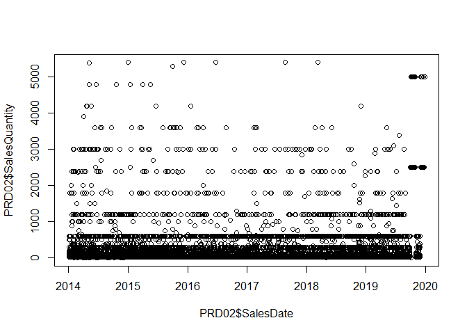<!-- -->

***YILLARA GÖRE GRUPLANDIRMA***

``` r
PRD2014 <- PRD02[PRD02$SalesDate >= "2014-01-01" & PRD02$SalesDate <= "2014-12-31" , c("CustomerAccount" , "SalesDate" , "ProductNumber" , "SalesQuantity" , "OrderNumber" , "Period" )]
PRD2015 <- PRD02[PRD02$SalesDate >= "2015-01-01" & PRD02$SalesDate <= "2015-12-31" , c("CustomerAccount" , "SalesDate" , "ProductNumber" , "SalesQuantity" , "OrderNumber" , "Period" )]
PRD2016 <- PRD02[PRD02$SalesDate >= "2016-01-01" & PRD02$SalesDate <= "2016-12-31" , c("CustomerAccount" , "SalesDate" , "ProductNumber" , "SalesQuantity" , "OrderNumber" , "Period" )]
PRD2017 <- PRD02[PRD02$SalesDate >= "2017-01-01" & PRD02$SalesDate <= "2017-12-31" , c("CustomerAccount" , "SalesDate" , "ProductNumber" , "SalesQuantity" , "OrderNumber" , "Period" )]
PRD2018 <- PRD02[PRD02$SalesDate >= "2018-01-01" & PRD02$SalesDate <= "2018-12-31" , c("CustomerAccount" , "SalesDate" , "ProductNumber" , "SalesQuantity" , "OrderNumber" , "Period" )]
PRD2019 <- PRD02[PRD02$SalesDate >= "2019-01-01" & PRD02$SalesDate <= "2019-12-31" , c("CustomerAccount" , "SalesDate" , "ProductNumber" , "SalesQuantity" , "OrderNumber" , "Period" )]
```

***YILLARI AYLARA GÖRE GRUPLANDIRMA***

``` r
sum14 <- PRD2014 %>%
  group_by(Period)%>%
  summarize(Toplam_Satis = sum(SalesQuantity))
```

    ## `summarise()` ungrouping output (override with `.groups` argument)

``` r
sum15 <- PRD2015 %>%
  group_by(Period)%>%
  summarize(Toplam_Satis = sum(SalesQuantity))
```

    ## `summarise()` ungrouping output (override with `.groups` argument)

``` r
sum16 <- PRD2016 %>%
  group_by(Period)%>%
  summarize(Toplam_Satis = sum(SalesQuantity))
```

    ## `summarise()` ungrouping output (override with `.groups` argument)

``` r
sum17 <- PRD2017 %>%
  group_by(Period)%>%
  summarize(Toplam_Satis = sum(SalesQuantity))
```

    ## `summarise()` ungrouping output (override with `.groups` argument)

``` r
sum18 <- PRD2018 %>%
  group_by(Period)%>%
  summarize(Toplam_Satis = sum(SalesQuantity))
```

    ## `summarise()` ungrouping output (override with `.groups` argument)

``` r
sum19 <- PRD2019 %>%
  group_by(Period)%>%
  summarize(Toplam_Satis = sum(SalesQuantity))
```

    ## `summarise()` ungrouping output (override with `.groups` argument)

6 YILI 72 AYA GÖRE GRUPLANDIRMA

``` r
sum72 <- PRD02 %>%
  group_by(Period)%>%
  summarize(Toplam_Satis = sum(SalesQuantity))
```

    ## `summarise()` ungrouping output (override with `.groups` argument)

``` r
sum72$Period <- c(1:72)
```

YILLAR TOPLAMI

``` r
#library(lubridate)
```

``` r
year_sum <- PRD02 %>%
  group_by(year(SalesDate))%>%
  summarize(Toplam_Satis = sum(SalesQuantity))
```

    ## `summarise()` ungrouping output (override with `.groups` argument)

YILLARA GÖRE SAÇILIM GRAFİĞİ

``` r
plot( 1:72 , sum72$Toplam_Satis ,
      pch = 20 , bty = "L",
      xlim = c(1 , 72),
      ylim = c(0 , 160000),
      main = "Aylara Göre Satış Toplamı",
      xlab = "Aylar",
      ylab = "Satış Miktarları"
)
```

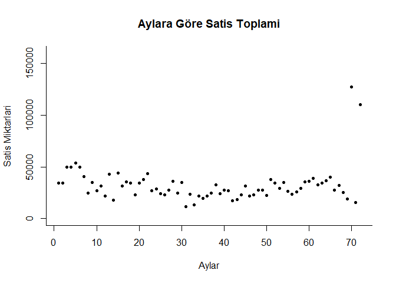<!-- -->

BOXPLOT GRAFİĞİ

``` r
boxplot(year_sum[ , c("Toplam_Satis")],
        main = "Yillara Göre Satış Adedinde Uç Yıllar",
        xlab = "2014-2019 Yıllari",
        ylab = "Satis Toplamlari",
        ylim = c(00000 , 600000),
        col = "orange",
        border = "black",
        pch = 19)
```

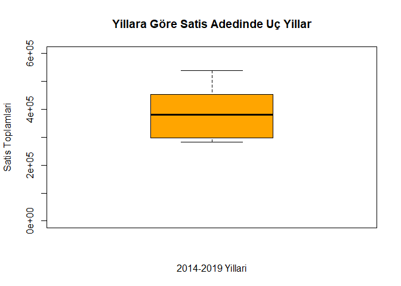<!-- -->

ISI HARİTASI

``` r
monthyearsum <- data.frame(
  aylar = c(1:12),
  "2014" = sum14$Toplam_Satis,
  "2015" = sum15$Toplam_Satis,
  "2016" = sum16$Toplam_Satis,
  "2017" = sum17$Toplam_Satis,
  "2018" = sum18$Toplam_Satis,
  "2019" = sum19$Toplam_Satis
)
monthyearmatrix <- as.matrix(monthyearsum)#ısı haritası matrix olmalı

#library(RColorBrewer)

heatmap(monthyearmatrix[ , -1 ] , scale = "column",
        Colv = NA , Rowv = NA, #aylar kolonunu ve dendrogramı çıkarttık
        cexRow = 1.3,
        cexCol = 1.3,
        col = colorRampPalette(brewer.pal(9 , "Blues"))(20))
legend("bottomright" , legend = c("Min" , "Ort" , "Max"),
       fill = colorRampPalette(brewer.pal(9 , "Blues"))(3)) # eger r script kullanmiyorsaniz satiri degil chunk'i cagirin
```

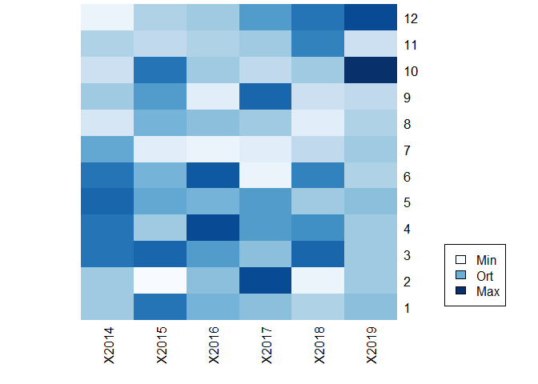<!-- -->

REGRESYON ANALİZİ

Regresyon analizi değişkene bağlı olarak farklılıkları inceler. Bizim
problemimizde amacımız satış tahminidir. Fakat herhangi bir kritere göre
değişimi incelemiyoruz. Zamana bağlı olarak hareketini ileriki dönem
zamanına uygun olarak tahminlemeye çalışıyoruz. Bu sebeple aşağıdaki
regresyon analizi mantıklı değildir. 1-72 arası olan dönem grubu ile
sayıların arttıkça satışların artması/azalması arasında bağlantı kuran
bir model oluşturmuştur. Fakat bizim böyle bir şeye ihtiyacımız yok.
Örneğin siparişi oluşturanların hangi şehirden sipariş verdiklerine ait
bir değişkenimiz olsaydı o zaman satış adedimizin sipariş verilen şehire
göre değişimini inceleyebilirdik. Zaman serisi analizlerinde regresyon
analizi karıştırılabildiği için eklemek istedim..

``` r
PRDmodel <- lm(Toplam_Satis ~ Period , data = sum72)
summary(PRDmodel)
```

    ## 
    ## Call:
    ## lm(formula = Toplam_Satis ~ Period, data = sum72)
    ## 
    ## Residuals:
    ##    Min     1Q Median     3Q    Max 
    ## -20225  -8649  -3753   4139  92706 
    ## 
    ## Coefficients:
    ##             Estimate Std. Error t value Pr(>|t|)    
    ## (Intercept) 29911.62    4101.75   7.292 3.65e-10 ***
    ## Period         69.79      97.66   0.715    0.477    
    ## ---
    ## Signif. codes:  0 '***' 0.001 '**' 0.01 '*' 0.05 '.' 0.1 ' ' 1
    ## 
    ## Residual standard error: 17220 on 70 degrees of freedom
    ## Multiple R-squared:  0.007242,   Adjusted R-squared:  -0.00694 
    ## F-statistic: 0.5107 on 1 and 70 DF,  p-value: 0.4772

***FORECAST METHODS***

R forecast package:
<https://cran.r-project.org/web/packages/forecast/forecast.pdf>

***Last Period’s Demand Method***

Son dönem talebine göre tahminleme, tahmin yöntemlerinde analizinin
basit olarak yapılabildiği ve bazı problemlerde kullanılabilen bir
yöntemdir. Önceki dönemin gerçek verisini sonraki dönemin tahmini yapar
ve gerçekleşen veriye göre hatayı ölçer. Bu şekilde geçerliliğinin
hesabı yapılır.

``` r
sum72_L <- sum72
sum72_L$Forecast <- rep(0,72) 
sum72_L$Forecast[c(2:72)] <- sum72$Toplam_Satis[c(1:71)]
head(sum72_L)
```

    ## # A tibble: 6 x 3
    ##   Period Toplam_Satis Forecast
    ##    <int>        <dbl>    <dbl>
    ## 1      1        34150        0
    ## 2      2        34525    34150
    ## 3      3        49775    34525
    ## 4      4        49825    49775
    ## 5      5        53976    49825
    ## 6      6        49575    53976

``` r
sum72_L$Error <- rep(0,72) 
sum72_L$Error[c(2:72)] <- abs(sum72_L$Forecast[c(2:72)] - sum72_L$Toplam_Satis[c(2:72)])
head(sum72_L)
```

    ## # A tibble: 6 x 4
    ##   Period Toplam_Satis Forecast Error
    ##    <int>        <dbl>    <dbl> <dbl>
    ## 1      1        34150        0     0
    ## 2      2        34525    34150   375
    ## 3      3        49775    34525 15250
    ## 4      4        49825    49775    50
    ## 5      5        53976    49825  4151
    ## 6      6        49575    53976  4401

``` r
sum(sum72_L$Error)/71 ##MAD ortalama mutlak sapma
```

    ## [1] 11292.42

``` r
sum72_L$ErrorSquare <- (sum72_L$Error)^2
sum(sum72_L$ErrorSquare)/71 ##MSE ortalama hata karesi
```

    ## [1] 549673215

``` r
sqrt(sum(sum72_L$ErrorSquare)/71) #RMSE kök ortalama hata kare
```

    ## [1] 23445.11

Hata değerleri formülleri için :
<https://veribilimcisi.com/2017/07/14/mse-rmse-mae-mape-metrikleri-nedir/>

***MOVING AVERAGE METHOD***

Hareketli Ortalama Yöntemi gelecek döneminin talep tahminini önceki
belirli sayıda bir dönemin gerçekleşmiş verilerinin ortalamaları olarak
belirler. Bu yöntem talebin yükselen bir eğim gösterdiği verisetlerinde
düşük bir sonuç tam tersi durumda yüksek bir sonuç ortaya koyacaktır.

``` r
#library(fpp2)
#library(TTR)
#library(forecast) 
S <-ts(sum72[,2],start=c(1),frequency=1)

TS <- data.frame(S)    

tttimeseries <- ts(TS)

smatt <- SMA(tttimeseries, 4) # lag is 4    

smatt
```

    ## Time Series:
    ## Start = 1 
    ## End = 72 
    ## Frequency = 1 
    ##  [1]       NA       NA       NA 42068.75 47025.25 50787.75 48544.00 42212.75
    ##  [9] 37475.25 31875.25 29625.75 28975.75 30988.00 28688.00 31800.00 34250.00
    ## [17] 32325.00 36456.25 31068.75 31775.00 32331.25 34625.00 35706.25 34243.75
    ## [25] 30843.75 25737.50 25912.50 27812.50 28043.75 30912.50 26943.75 23718.75
    ## [33] 20875.00 17718.75 19687.50 19300.00 22050.00 24718.75 25793.75 27181.25
    ## [41] 27812.50 23975.00 22568.75 21512.50 22575.00 23668.75 24881.25 25912.50
    ## [49] 24918.75 25068.75 28656.25 30412.50 30856.50 33950.25 31219.00 28487.75
    ## [57] 27593.75 26187.50 28375.00 31493.75 34825.00 35650.00 35356.25 35531.25
    ## [65] 35856.25 34637.50 34087.50 31312.50 26012.50 50994.50 46919.50 68057.00

``` r
smatt <- smatt[-c(1:3)]

forecasttt <- forecast(smatt, 3) # future 3 values
summary(forecasttt)
```

    ## 
    ## Forecast method: ETS(M,N,N)
    ## 
    ## Model Information:
    ## ETS(M,N,N) 
    ## 
    ## Call:
    ##  ets(y = object, lambda = lambda, biasadj = biasadj, allow.multiplicative.trend = allow.multiplicative.trend) 
    ## 
    ##   Smoothing parameters:
    ##     alpha = 0.7732 
    ## 
    ##   Initial states:
    ##     l = 42329.7707 
    ## 
    ##   sigma:  0.1515
    ## 
    ##      AIC     AICc      BIC 
    ## 1459.030 1459.399 1465.732 
    ## 
    ## Error measures:
    ##                    ME     RMSE      MAE        MPE     MAPE     MASE      ACF1
    ## Training set 391.1294 4804.218 2972.798 -0.2075935 8.990545 1.039465 0.1222171
    ## 
    ## Forecasts:
    ##    Point Forecast    Lo 80    Hi 80    Lo 95    Hi 95
    ## 70       63197.75 50929.35 75466.16 44434.85 81960.66
    ## 71       63197.75 47623.11 78772.39 39378.40 87017.11
    ## 72       63197.75 44870.51 81525.00 35168.65 91226.85

***EXPONENTIAL SMOOTHING METHOD***

Üstel düzeltme yöntemi, ağırlıklı ortalama yöntemini baz alan bir
tahminleme metodudur. Ağırlıklı ortalama, hareketli ağırlıklı ortlama
yöntemlerinin daha da geliştirilmiş bir yoludur. Amacı ya da daha
doğrusu sistemi, yakın geçmiş dönemleri daha ağırlıklı olarak dikkate
alarak bir ortalama hesaplamaktır. Bu ortalamayı da gelecek dönemlerin
tahmininde kullanır. Yöntemde kullanılan bir alpha değeri bulunmaktadır.
Bu alpha katsayısı 0 ile 1 arası bir değer olmakla beraber son dönemin
ne derecede dikkate alınması gerektiğini belirler. 0 değerini alırsa
daha önce bahsettiğimiz son dönem talebine göre tahminleme metoduna
dönüşür. Yüksek alpha değerleri dalgalanan talep miktarlarında ve son
döneme ilişkin analizlerde kullanılırken düşük alpha değerleri daha
kararlı yapıya ait sistemlerde ve daha uzun döneme yapılan
tahminlemelerde görülür.

***Simple Exponential Smoothing***

Sezona bağlı olmayan veriler için yapılacak tahminlemelerde kullanılan
yöntemlerdendir.

``` r
Z <-ts(sum72[ ,2], start=c(1),frequency=1)
head(Z)
```

    ## Time Series:
    ## Start = 1 
    ## End = 6 
    ## Frequency = 1 
    ##      Toplam_Satis
    ## [1,]        34150
    ## [2,]        34525
    ## [3,]        49775
    ## [4,]        49825
    ## [5,]        53976
    ## [6,]        49575

``` r
esmtt <- window(Z, end = 60)
esmtf <- window(Z, start = 61)
```

İlk olarak train ve test olarak iki gruba ayırıyoruz. Daha sonra train
(esmtt), 60 aylık olan verimizi ses’e(simple exponential smoothing)
veriyoruz. Yukarıda bahsettiğimiz alpha değerini ve tahmin etmeye
çalıştığımız 12 ay için h=12 değerini fonksiyona veriyoruz.

Simple ES, hesaplaması için bir örnek verelim. Örneğin ilk 4 dönem
verimiz sırasıyla \[6000,4000,8000,7000\] ve alpha=0.7 olsun. 4. Dönem
tahminini ilk üç ayın ortalaması ile belirleyelim. (Başka bir yöntem de
kullanabilirdik burada..) 4. dönem tahmini = (6000+4000+8000)/3 = 6000.
5. ay tahmminini ise basit üstel düzeltme ile yapalım. tahmin\_5.ay =
(0.7 x 7000) + ((1-0.7) x 6000)) = 6700

``` r
ses.esmt <- ses(esmtt, alpha = .2, h = 12)
ses.esmt
```

    ##    Point Forecast    Lo 80    Hi 80    Lo 95    Hi 95
    ## 61       30691.92 20430.60 40953.23 14998.59 46385.24
    ## 62       30691.92 20227.39 41156.44 14687.81 46696.03
    ## 63       30691.92 20028.05 41355.78 14382.94 47000.89
    ## 64       30691.92 19832.36 41551.47 14083.67 47300.17
    ## 65       30691.92 19640.15 41743.69 13789.69 47594.14
    ## 66       30691.92 19451.21 41932.62 13500.74 47883.09
    ## 67       30691.92 19265.40 42118.43 13216.57 48167.26
    ## 68       30691.92 19082.57 42301.26 12936.95 48446.88
    ## 69       30691.92 18902.57 42481.26 12661.66 48722.17
    ## 70       30691.92 18725.27 42658.56 12390.52 48993.32
    ## 71       30691.92 18550.57 42833.26 12123.33 49260.50
    ## 72       30691.92 18378.34 43005.49 11859.93 49523.90

``` r
autoplot(ses.esmt)
```

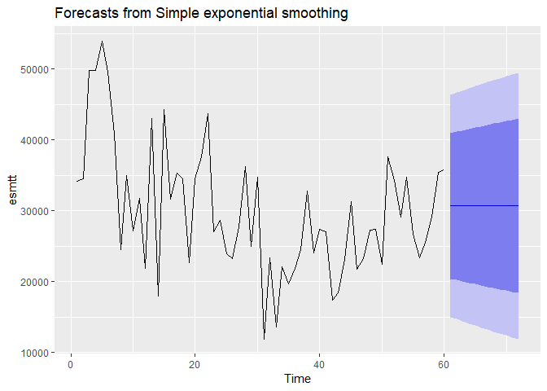<!-- -->

Tahminimiz grafikte görüldüğü üzere düz bir şekilde gelecek tahminlemesi
yaptı. Bu yöntem mevsimsel ve dönemsel dalgalanmaya sahip olmayan, düz
bir gelecek beklentisi çevresinde hareket eden serilerin analizinde
uygulanmaktadır.

``` r
esmt.dif <- diff(esmtt)
esmt.dif
```

    ## Time Series:
    ## Start = 2 
    ## End = 60 
    ## Frequency = 1 
    ##       Toplam_Satis
    ##  [1,]          375
    ##  [2,]        15250
    ##  [3,]           50
    ##  [4,]         4151
    ##  [5,]        -4401
    ##  [6,]        -8775
    ##  [7,]       -16300
    ##  [8,]        10526
    ##  [9,]        -7851
    ## [10,]         4627
    ## [11,]        -9902
    ## [12,]        21175
    ## [13,]       -25100
    ## [14,]        26275
    ## [15,]       -12550
    ## [16,]         3675
    ## [17,]         -875
    ## [18,]       -11800
    ## [19,]        11825
    ## [20,]         3075
    ## [21,]         6075
    ## [22,]       -16650
    ## [23,]         1650
    ## [24,]        -4675
    ## [25,]         -750
    ## [26,]         4475
    ## [27,]         8550
    ## [28,]       -11350
    ## [29,]         9800
    ## [30,]       -22875
    ## [31,]        11525
    ## [32,]        -9825
    ## [33,]         8550
    ## [34,]        -2375
    ## [35,]         2100
    ## [36,]         2725
    ## [37,]         8225
    ## [38,]        -8750
    ## [39,]         3350
    ## [40,]         -300
    ## [41,]        -9650
    ## [42,]          975
    ## [43,]         4750
    ## [44,]         8175
    ## [45,]        -9525
    ## [46,]         1450
    ## [47,]         4025
    ## [48,]           75
    ## [49,]        -4950
    ## [50,]        15200
    ## [51,]        -3300
    ## [52,]        -5174
    ## [53,]         5649
    ## [54,]        -8100
    ## [55,]        -3300
    ## [56,]         2175
    ## [57,]         3600
    ## [58,]         6275
    ## [59,]          425

``` r
autoplot(esmt.dif)
```

<!-- -->

Düz,doğrusal bir tahmini düzeltmek için trendi kaldırıp verilerimizi
farklılaştırıyoruz. esmt.diff önceki döneme göre toplam satış adedindeki
değişimi temsil eder.

``` r
ses.esmt.dif <- ses(esmt.dif, alpha = .2, h = 12)
autoplot(ses.esmt.dif)
```

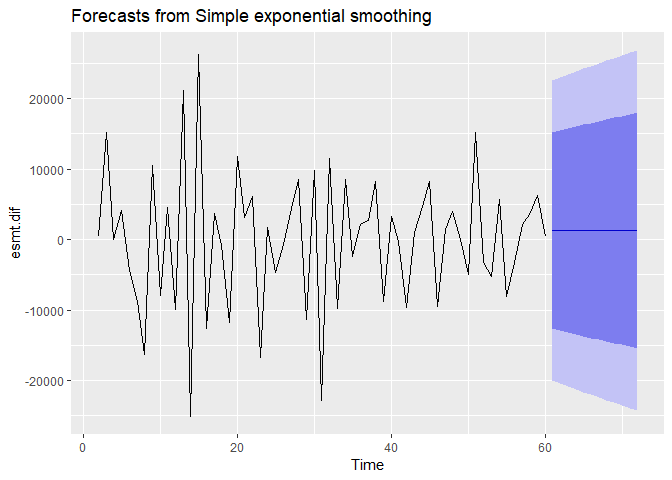<!-- -->

``` r
esmt.dif.test <- diff(esmtf)
accuracy(ses.esmt.dif, esmt.dif.test)
```

    ##                      ME     RMSE       MAE       MPE      MAPE      MASE
    ## Training set  -14.08762 10672.88  8337.741 -51.18612 269.65849 0.6224918
    ## Test set     5176.38295 55030.74 32503.770  88.75091  88.75091 2.4267161
    ##                    ACF1 Theil's U
    ## Training set -0.6176126        NA
    ## Test set     -0.7082782 0.9167161

Daha sonra amacımız en uygun alpha değerini seçmektir. Bunu 0 ve 1
arasında 100 sayı oluşturup döngüye alıp hepsinin hata oranını alarak
buluyoruz. En düşük hata oranını sağlayan alpha optimal oluyor.

``` r
alpha <- seq(.01, .99, by = .01)
RMSE <- NA
for(i in seq_along(alpha)) {
  fit <- ses(esmt.dif, alpha = alpha[i], h = 12)
  RMSE[i] <- accuracy(fit, esmt.dif.test)[2,2]
}
```

DataFrame’e dönüştürüp uygun a değerini bulma

``` r
alpha.fit <- data.frame(alpha, RMSE)
alpha.min <- filter(alpha.fit, RMSE == min(RMSE))
is.na(alpha.min)
```

    ##      alpha  RMSE
    ## [1,] FALSE FALSE

``` r
indexx <- data.frame(
  alpha = alpha.min[1 , 1],
  RMSE = alpha.min[1, 2])
```

Plot RMSE vs. alpha

``` r
#library(ggplot2)

ggplot(alpha.fit, aes(alpha, RMSE)) +
  geom_line() +
  geom_point(data = indexx, aes(alpha, RMSE), size = 3, color = "blue") 
```

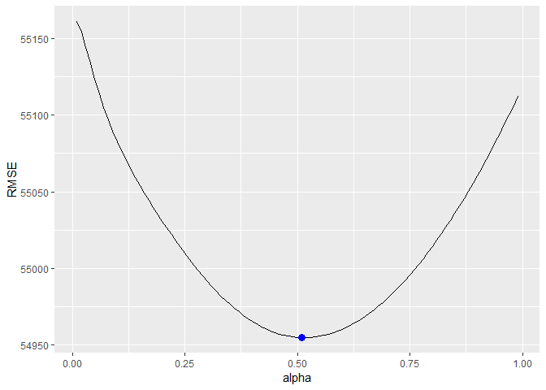<!-- -->

Uygun alpha degerine gore tahminleme

``` r
ses.esmt <- ses(esmtt, alpha = alpha.min[1, 1], h = 12)
autoplot(ses.esmt)
```

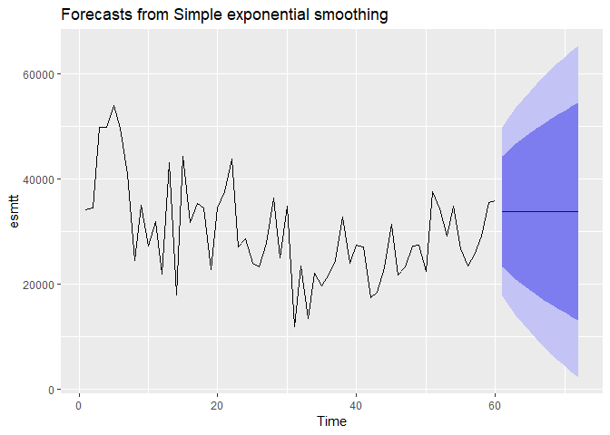<!-- -->

``` r
esmt.dif <- diff(esmtt)
autoplot(esmt.dif)
```

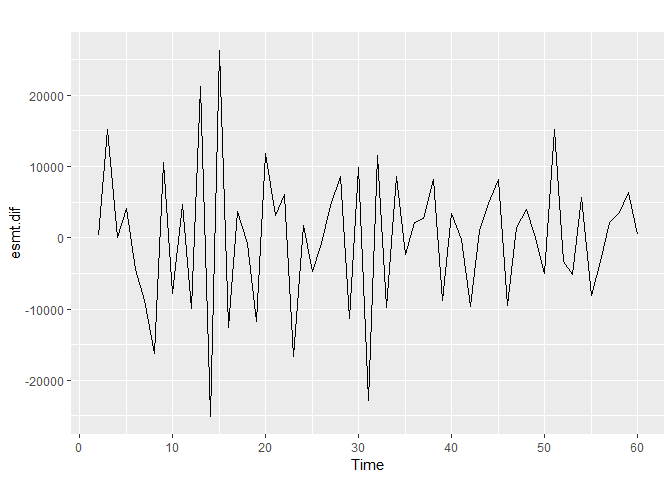<!-- -->

``` r
ses.esmt.dif <- ses(esmt.dif, alpha = alpha.min[1, 1], h = 12)
autoplot(ses.esmt.dif)
```

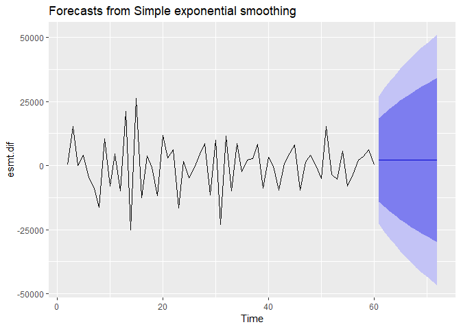<!-- -->

``` r
esmt.dif.test <- diff(esmtf)
accuracy(ses.esmt.dif, esmt.dif.test)
```

    ##                      ME     RMSE       MAE        MPE      MAPE      MASE
    ## Training set  -57.81233 12493.12  9697.814 -238.71278 507.13763 0.7240342
    ## Test set     4296.06205 54954.92 32490.986   81.07149  84.80732 2.4257616
    ##                    ACF1 Theil's U
    ## Training set -0.6933655        NA
    ## Test set     -0.7082782   0.91289

***Holt’s exponential smoothing(ciftli ustel duzeltme)***

SES, uzun vadeli bir trende sahip verilerle iyi performans
göstermeyebilir. Son olarak, fark alma (diff) ile trendi nasıl
kaldırabileceğimizi ve sonrasında SES ile tekrarlayabileceğimize
baktık. Verilerdeki trendi yakalarken üstel yumuşatma uygulamak için
alternatif bir yöntem ise Holt Yöntemini kullanmaktır .

Holt’un çiftli üstel düzeltmesindeki farkı şu örnekle gösterelim.

Örnek: Bugüne kadarki kan testlerinin haftalık ortalaması 28 ve trend
3’tür. Bu haftanın talebi 27 kan testidir. 2. ve 3. haftanın trende
göre tahminini yapın?(a: 0.2 ve b: 0.20)

Lt –\> t zamanındaki seviye tahmini (a x At) + (1-a) x (Lt-1 + Tt-1) Tt
–\> t zamanındaki trend tahmini b x (Lt - Lt-1) + (1-b) x Tt-1 Ft+m Lt
+ (m x Tt)

\#Lo = 28 To = 3 L1 = (0.2)x(27) + (0.8)x(27+3) L1 = 30.2

\#T1 = 0.2 x (30.2 - 28) + (0.8) x 3 T1 = 2.8

\#F2 = 30.2 + 1 x (2.8) F2 = 33

\#F3 = 30.2 + 2 x (2.8) F2 = 35.8

Holt fonksiyonunu manuel olarak ayarlayabiliriz. Parametreler alpha ve
beta; bu parametreleri NULL olarak bırakırsak, holt aslında en uygun
model parametrelerini belirleyecektir. Bunu AIC ve BIC değerlerini
minimize ederek yapacaktır.

``` r
holtesmt <- holt(esmtt, h = 12)
autoplot(holtesmt)
```

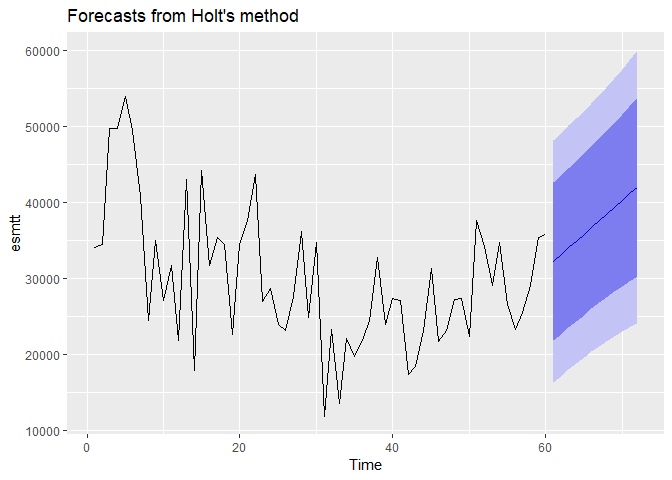<!-- -->

``` r
holtesmt$model
```

    ## Holt's method 
    ## 
    ## Call:
    ##  holt(y = esmtt, h = 12) 
    ## 
    ##   Smoothing parameters:
    ##     alpha = 0.0439 
    ##     beta  = 0.017 
    ## 
    ##   Initial states:
    ##     l = 45604.2848 
    ##     b = -699.0246 
    ## 
    ##   sigma:  8152.335
    ## 
    ##      AIC     AICc      BIC 
    ## 1332.248 1333.359 1342.720

``` r
accuracy(holtesmt, esmtf)
```

    ##                    ME      RMSE       MAE         MPE     MAPE      MASE
    ## Training set 1559.007  7875.903  6305.355  -0.5022877 22.29914 0.8456715
    ## Test set     7798.718 33708.801 20186.088 -17.5104122 44.67060 2.7073493
    ##                    ACF1 Theil's U
    ## Training set  0.1523681        NA
    ## Test set     -0.4325794 0.7647601

***SEASONAL***

``` r
sum72_2 <- cbind(sum72, c(rep(1,3),rep(2,3), rep(3,3), rep(4,3)))
sum72_3 <- cbind(sum72_2, c(rep(2014,12),rep(2015,12),rep(2016,12),rep(2017,12),rep(2018,12),rep(2019,12)))
colnames(sum72_3) <- c("Period","Sales","Quarter","Year")
sum72_3 <- sum72_3[c("Year","Quarter","Period","Sales")]

head(sum72_3)
```

    ##   Year Quarter Period Sales
    ## 1 2014       1      1 34150
    ## 2 2014       1      2 34525
    ## 3 2014       1      3 49775
    ## 4 2014       2      4 49825
    ## 5 2014       2      5 53976
    ## 6 2014       2      6 49575

``` r
R <- ts(sum72_3$Sales)
plot(R , xlim = c(0,84))
```

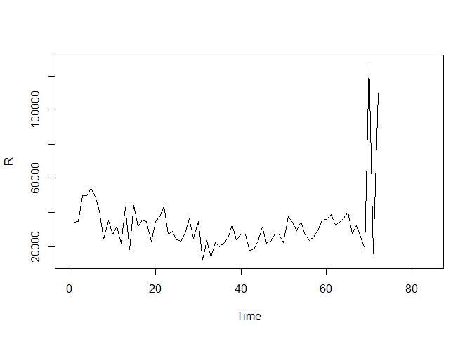<!-- -->

``` r
sum72_3$Quarter <- as.factor(sum72_3$Quarter)
output <- lm(Sales ~ Quarter, data = sum72_3)
summary(output)
```

    ## 
    ## Call:
    ## lm(formula = Sales ~ Quarter, data = sum72_3)
    ## 
    ## Residuals:
    ##    Min     1Q Median     3Q    Max 
    ## -21467  -8186  -2233   3338  90286 
    ## 
    ## Coefficients:
    ##             Estimate Std. Error t value Pr(>|t|)    
    ## (Intercept)    31833       4008   7.942 2.79e-11 ***
    ## Quarter2        2903       5668   0.512    0.610    
    ## Quarter3       -5785       5668  -1.021    0.311    
    ## Quarter4        5384       5668   0.950    0.346    
    ## ---
    ## Signif. codes:  0 '***' 0.001 '**' 0.01 '*' 0.05 '.' 0.1 ' ' 1
    ## 
    ## Residual standard error: 17010 on 68 degrees of freedom
    ## Multiple R-squared:  0.05966,    Adjusted R-squared:  0.01817 
    ## F-statistic: 1.438 on 3 and 68 DF,  p-value: 0.2393

``` r
output2 <- lm(Sales ~ factor(Quarter, exclude = "4"), data = sum72_3)
summary(output2)
```

    ## 
    ## Call:
    ## lm(formula = Sales ~ factor(Quarter, exclude = "4"), data = sum72_3)
    ## 
    ## Residuals:
    ##      Min       1Q   Median       3Q      Max 
    ## -17311.2  -7139.3   -336.2   5398.2  19239.8 
    ## 
    ## Coefficients:
    ##                                 Estimate Std. Error t value Pr(>|t|)    
    ## (Intercept)                        31833       2034  15.651   <2e-16 ***
    ## factor(Quarter, exclude = "4")2     2903       2876   1.009   0.3177    
    ## factor(Quarter, exclude = "4")3    -5785       2876  -2.011   0.0496 *  
    ## ---
    ## Signif. codes:  0 '***' 0.001 '**' 0.01 '*' 0.05 '.' 0.1 ' ' 1
    ## 
    ## Residual standard error: 8629 on 51 degrees of freedom
    ##   (18 observations deleted due to missingness)
    ## Multiple R-squared:  0.1564, Adjusted R-squared:  0.1233 
    ## F-statistic: 4.728 on 2 and 51 DF,  p-value: 0.01307

***ARIMA***

ARIMA, Otomatik Gerilemeli Entegre Hareketli Ortalama anlamına gelir ve
üç sıra parametresi ile belirtilir: (p, d, q).

AR(p) Otoregresyon: Mevcut bir gözlem ile önceki bir döneme ilişkin
gözlemler arasındaki bağımlı ilişkiyi kullanan bir regresyon modeli.
Bir otoregresif (AR(p)) bileşeni, zaman serileri için regresyon
denklemindeki geçmiş değerlerin kullanımına atıfta bulunur.

I(d) Entegrasyon: Zaman serisini durağan hale getirmek için gözlemlerin
farkını (bir önceki zaman adımındaki gözlemden bir gözlemi çıkarma)
kullanır. Fark alma, bir serinin mevcut değerlerinin önceki değerleriyle
d kez çıkarılmasını içerir.

MA(q) Hareketli Ortalama: Bir gözlem ile gecikmeli gözlemlere uygulanan
hareketli ortalama modelinden kalan hata arasındaki bağımlılığı kullanan
bir model. Hareketli ortalama bileşeni, modelin hatasını önceki hata
terimlerinin bir kombinasyonu olarak gösterir. q sırası, modele dahil
edilecek terimlerin sayısını temsil eder.

Amacı kısaca serinin geçmiş değerlerinden ve geçmişte yapılan tahmin
hatalarından değişkenin gelecek değerini tahmin etmektir.

Bakabilirsiniz :
<https://www.rdocumentation.org/packages/stats/versions/3.6.2/topics/arima>

Tahminleme yapmadan grafik çizme

``` r
plot(Z , main = "Graph without forecasting",
     col.main = "darkgreen")
```

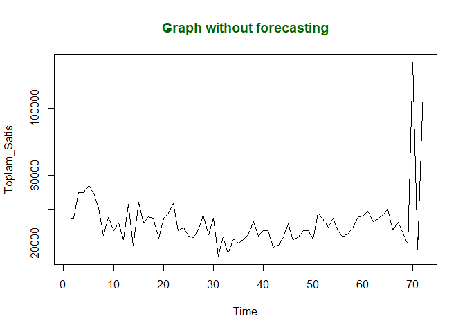<!-- -->

Arima ile model oluşturma

``` r
fit <- auto.arima(Z)
```

Gelecek 12 dönem tahmini

``` r
forecastedValues <- forecast(fit, 12)
print(forecastedValues)
```

    ##    Point Forecast    Lo 80    Hi 80     Lo 95    Hi 95
    ## 73       29392.93 11641.60 47144.26  2244.621 56541.24
    ## 74       38523.84 20724.57 56323.10 11302.213 65745.47
    ## 75       32487.30 10559.02 54415.58 -1049.108 66023.71
    ## 76       32487.30 10559.02 54415.58 -1049.108 66023.71
    ## 77       32487.30 10559.02 54415.58 -1049.108 66023.71
    ## 78       32487.30 10559.02 54415.58 -1049.108 66023.71
    ## 79       32487.30 10559.02 54415.58 -1049.108 66023.71
    ## 80       32487.30 10559.02 54415.58 -1049.108 66023.71
    ## 81       32487.30 10559.02 54415.58 -1049.108 66023.71
    ## 82       32487.30 10559.02 54415.58 -1049.108 66023.71
    ## 83       32487.30 10559.02 54415.58 -1049.108 66023.71
    ## 84       32487.30 10559.02 54415.58 -1049.108 66023.71

``` r
plot(forecastedValues, main = "Graph with forecasting",
     col.main = "darkgreen") 
```

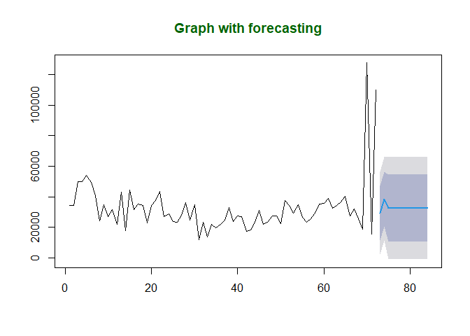<!-- -->

Son yıl hariç tutularak arima modeli oluşturma

``` r
fit <- auto.arima(Z)
fit2 <- auto.arima(head(Z, -12))
summary(fit2)
```

    ## Series: head(Z, -12) 
    ## ARIMA(1,1,0) 
    ## 
    ## Coefficients:
    ##           ar1
    ##       -0.5842
    ## s.e.   0.1031
    ## 
    ## sigma^2 estimated as 61834182:  log likelihood=-612.65
    ## AIC=1229.3   AICc=1229.52   BIC=1233.46
    ## 
    ## Training set error measures:
    ##                    ME     RMSE      MAE     MPE     MAPE     MASE      ACF1
    ## Training set 40.14022 7731.303 6141.826 -5.3413 22.80742 0.823739 0.0183058

Arima modellemeleri için: <https://people.duke.edu/~rnau/411arim.htm>

Gelecek 24 dönem tahmini

``` r
forecastedValues2 <- forecast(fit2, 24)
print(forecastedValues2)
```

    ##    Point Forecast     Lo 80    Hi 80      Lo 95    Hi 95
    ## 61       35601.70 25524.258 45679.15  20189.582 51013.82
    ## 62       35746.77 24833.005 46660.53  19055.609 52437.92
    ## 63       35662.02 22345.836 48978.19  15296.676 56027.35
    ## 64       35711.53 21257.974 50165.08  13606.725 57816.33
    ## 65       35682.60 19711.862 51653.34  11257.463 60107.74
    ## 66       35699.50 18600.553 52798.45   9548.916 61850.09
    ## 67       35689.63 17393.738 53985.52   7708.480 63670.78
    ## 68       35695.40 16353.416 55037.38   6114.389 65276.40
    ## 69       35692.03 15315.076 56068.98   4528.171 66855.88
    ## 70       35694.00 14356.009 57031.98   3060.362 68327.63
    ## 71       35692.84 13421.954 57963.74   1632.457 69753.23
    ## 72       35693.52 12534.754 58852.28    275.245 71111.79
    ## 73       35693.12 11675.075 59711.17  -1039.313 72425.56
    ## 74       35693.35 10848.100 60538.61  -2304.183 73690.89
    ## 75       35693.22 10046.080 61340.36  -3530.696 74917.14
    ## 76       35693.30  9269.361 62117.24  -4718.627 76105.22
    ## 77       35693.25  8514.276 62872.23  -5873.406 77259.91
    ## 78       35693.28  7779.926 63606.63  -6996.511 78383.07
    ## 79       35693.26  7064.225 64322.30  -8091.073 79477.60
    ## 80       35693.27  6366.088 65020.46  -9158.785 80545.33
    ## 81       35693.27  5684.130 65702.40 -10201.748 81588.28
    ## 82       35693.27  5017.362 66369.18 -11221.483 82608.02
    ## 83       35693.27  4364.762 67021.77 -12219.547 83606.08
    ## 84       35693.27  3725.494 67661.05 -13197.225 84583.76

``` r
plot(forecastedValues2, main = "Graph with forecasting",
     col.main = "darkgreen") 
```

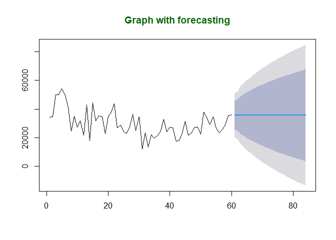<!-- -->

***KARŞILAŞTIRMALAR***

Last Period’s Demand

``` r
sum(sum72_L$Error)/71 ##MAD ortalama mutlak sapma
```

    ## [1] 11292.42

``` r
sum(sum72_L$ErrorSquare)/71 ##MSE ortalama hata karesi
```

    ## [1] 549673215

``` r
sqrt(sum(sum72_L$ErrorSquare)/71) #RMSE kök ortalama hata kare
```

    ## [1] 23445.11

Moving Average

``` r
summary(forecasttt)
```

    ## 
    ## Forecast method: ETS(M,N,N)
    ## 
    ## Model Information:
    ## ETS(M,N,N) 
    ## 
    ## Call:
    ##  ets(y = object, lambda = lambda, biasadj = biasadj, allow.multiplicative.trend = allow.multiplicative.trend) 
    ## 
    ##   Smoothing parameters:
    ##     alpha = 0.7732 
    ## 
    ##   Initial states:
    ##     l = 42329.7707 
    ## 
    ##   sigma:  0.1515
    ## 
    ##      AIC     AICc      BIC 
    ## 1459.030 1459.399 1465.732 
    ## 
    ## Error measures:
    ##                    ME     RMSE      MAE        MPE     MAPE     MASE      ACF1
    ## Training set 391.1294 4804.218 2972.798 -0.2075935 8.990545 1.039465 0.1222171
    ## 
    ## Forecasts:
    ##    Point Forecast    Lo 80    Hi 80    Lo 95    Hi 95
    ## 70       63197.75 50929.35 75466.16 44434.85 81960.66
    ## 71       63197.75 47623.11 78772.39 39378.40 87017.11
    ## 72       63197.75 44870.51 81525.00 35168.65 91226.85

Simple Exponential

``` r
accuracy(ses.esmt.dif, esmt.dif.test)
```

    ##                      ME     RMSE       MAE        MPE      MAPE      MASE
    ## Training set  -57.81233 12493.12  9697.814 -238.71278 507.13763 0.7240342
    ## Test set     4296.06205 54954.92 32490.986   81.07149  84.80732 2.4257616
    ##                    ACF1 Theil's U
    ## Training set -0.6933655        NA
    ## Test set     -0.7082782   0.91289

Holt’s exponential

``` r
accuracy(holtesmt, esmtf)
```

    ##                    ME      RMSE       MAE         MPE     MAPE      MASE
    ## Training set 1559.007  7875.903  6305.355  -0.5022877 22.29914 0.8456715
    ## Test set     7798.718 33708.801 20186.088 -17.5104122 44.67060 2.7073493
    ##                    ACF1 Theil's U
    ## Training set  0.1523681        NA
    ## Test set     -0.4325794 0.7647601

Seasonal

``` r
summary(output)
```

    ## 
    ## Call:
    ## lm(formula = Sales ~ Quarter, data = sum72_3)
    ## 
    ## Residuals:
    ##    Min     1Q Median     3Q    Max 
    ## -21467  -8186  -2233   3338  90286 
    ## 
    ## Coefficients:
    ##             Estimate Std. Error t value Pr(>|t|)    
    ## (Intercept)    31833       4008   7.942 2.79e-11 ***
    ## Quarter2        2903       5668   0.512    0.610    
    ## Quarter3       -5785       5668  -1.021    0.311    
    ## Quarter4        5384       5668   0.950    0.346    
    ## ---
    ## Signif. codes:  0 '***' 0.001 '**' 0.01 '*' 0.05 '.' 0.1 ' ' 1
    ## 
    ## Residual standard error: 17010 on 68 degrees of freedom
    ## Multiple R-squared:  0.05966,    Adjusted R-squared:  0.01817 
    ## F-statistic: 1.438 on 3 and 68 DF,  p-value: 0.2393

``` r
mse <- mean(residuals(output)^2)
rmse <- sqrt(mse)
rmse
```

    ## [1] 16526.1

Arima

``` r
summary(fit)
```

    ## Series: Z 
    ## ARIMA(0,0,2) with non-zero mean 
    ## 
    ## Coefficients:
    ##           ma1     ma2      mean
    ##       -0.0735  0.7215  32487.30
    ## s.e.   0.1041  0.0926   2604.49
    ## 
    ## sigma^2 estimated as 191862187:  log likelihood=-787.97
    ## AIC=1583.94   AICc=1584.54   BIC=1593.05
    ## 
    ## Training set error measures:
    ##                     ME     RMSE      MAE       MPE    MAPE      MASE
    ## Training set -2.675637 13559.79 7328.729 -10.28796 23.8232 0.6489953
    ##                     ACF1
    ## Training set 0.002524839

``` r
summary(fit2)
```

    ## Series: head(Z, -12) 
    ## ARIMA(1,1,0) 
    ## 
    ## Coefficients:
    ##           ar1
    ##       -0.5842
    ## s.e.   0.1031
    ## 
    ## sigma^2 estimated as 61834182:  log likelihood=-612.65
    ## AIC=1229.3   AICc=1229.52   BIC=1233.46
    ## 
    ## Training set error measures:
    ##                    ME     RMSE      MAE     MPE     MAPE     MASE      ACF1
    ## Training set 40.14022 7731.303 6141.826 -5.3413 22.80742 0.823739 0.0183058

``` r
Z
```

    ## Time Series:
    ## Start = 1 
    ## End = 72 
    ## Frequency = 1 
    ##       Toplam_Satis
    ##  [1,]        34150
    ##  [2,]        34525
    ##  [3,]        49775
    ##  [4,]        49825
    ##  [5,]        53976
    ##  [6,]        49575
    ##  [7,]        40800
    ##  [8,]        24500
    ##  [9,]        35026
    ## [10,]        27175
    ## [11,]        31802
    ## [12,]        21900
    ## [13,]        43075
    ## [14,]        17975
    ## [15,]        44250
    ## [16,]        31700
    ## [17,]        35375
    ## [18,]        34500
    ## [19,]        22700
    ## [20,]        34525
    ## [21,]        37600
    ## [22,]        43675
    ## [23,]        27025
    ## [24,]        28675
    ## [25,]        24000
    ## [26,]        23250
    ## [27,]        27725
    ## [28,]        36275
    ## [29,]        24925
    ## [30,]        34725
    ## [31,]        11850
    ## [32,]        23375
    ## [33,]        13550
    ## [34,]        22100
    ## [35,]        19725
    ## [36,]        21825
    ## [37,]        24550
    ## [38,]        32775
    ## [39,]        24025
    ## [40,]        27375
    ## [41,]        27075
    ## [42,]        17425
    ## [43,]        18400
    ## [44,]        23150
    ## [45,]        31325
    ## [46,]        21800
    ## [47,]        23250
    ## [48,]        27275
    ## [49,]        27350
    ## [50,]        22400
    ## [51,]        37600
    ## [52,]        34300
    ## [53,]        29126
    ## [54,]        34775
    ## [55,]        26675
    ## [56,]        23375
    ## [57,]        25550
    ## [58,]        29150
    ## [59,]        35425
    ## [60,]        35850
    ## [61,]        38875
    ## [62,]        32450
    ## [63,]        34250
    ## [64,]        36550
    ## [65,]        40175
    ## [66,]        27575
    ## [67,]        32050
    ## [68,]        25450
    ## [69,]        18975
    ## [70,]       127503
    ## [71,]        15750
    ## [72,]       110000

``` r
fit
```

    ## Series: Z 
    ## ARIMA(0,0,2) with non-zero mean 
    ## 
    ## Coefficients:
    ##           ma1     ma2      mean
    ##       -0.0735  0.7215  32487.30
    ## s.e.   0.1041  0.0926   2604.49
    ## 
    ## sigma^2 estimated as 191862187:  log likelihood=-787.97
    ## AIC=1583.94   AICc=1584.54   BIC=1593.05

``` r
fit2
```

    ## Series: head(Z, -12) 
    ## ARIMA(1,1,0) 
    ## 
    ## Coefficients:
    ##           ar1
    ##       -0.5842
    ## s.e.   0.1031
    ## 
    ## sigma^2 estimated as 61834182:  log likelihood=-612.65
    ## AIC=1229.3   AICc=1229.52   BIC=1233.46

Tahmin Performans Ölçütlerinden RMSE(Root Mean Square Error) (Kök
Ortalama Hata Karesi) yöntemine göre karşılaştırma yapabiliriz. RMSE
tahminleyicinin tahmin ettiği değerler ile gerçek değerleri arasındaki
uzaklığın bulunmasında sıklıkla kullanılan, hatanın büyüklğünü ölçen
kuadratik bir metriktir. RMSE tahmin hatalarının (kalıntıların) standart
sapmasıdır. Karşılaştırmalar içerisinde farklı hata metrikleri de
incelenmiştir. Bütün metotların ortak bir hata metriğinde
karşılaştırılması için RMSE seçilmiştir.

MAE ve RMSE hata metrikleri incelendiğinde iki farklı model için MAE’ye
göre model 1 RMSE’ye göre model 2 daha iyi çıkabilir. RMSE hatanın ilk
olarak karesini aldığı için, RMSE de model 2’nin büyük çıkması bize hata
değerlerinde model 2’de büyük değerlerin daha fazla olduğunu söyler.

Özet kısımlarında görülen AIC ve BIC ise farklı diğer hata
metrikleridir. Akaike ve Bayasen metrikleri iki veya daha fazla model
birbirleriyle karşılaştırılırken kullanılır. İçerisinde modeldeki
parametre sayısını belirten k parametresi bulunur. Genellikle makine
öğrenmesi girişinde modellemeler yaparken veri düzenlemelerinde
oluşturulan farklı modellerde iyileşme incelemesinin yapılması amacıyla
model karşılaştırmalarında kullanılır.

Bu problemimizde en düşük RMSE sonucu moving average yöntemine aittir.
Hareketli ortalama yöntemi önceki 4 ayın ortalamasını tahmin olarak
sunduğu için verimizin akışına uygun olmayan son ayları yumuşatmıştır.
Örneğin son dönem talebi veya son döneme ağırlık veren basit üstel
düzeltme yöntemleri son aylarda (70 71 72. aylarda) hata değerini
düşürememişlerdir. Sebebi ise şöyledir: 70. ay 127k iken 71. ay 15k
satış adedi görülür. Biz 71. ay için tahminleme yaparken 70.aya ağırlık
vererek tahmninleme yaparsak yüksek hata alırız.

Sezonsallık ise bu veri setinde anlam bulamamıştır. Çeyrekliklere göre
yapılan hesaplamalarda Adj R square çok düşük çıkmıştır. Ayrıca 72 aylık
grafik incelendiğinde görsel olarak da belirli aylar için iniş çıkış
gözlemlenmemiştir.

``` r
plot(sum72_3$Quarter,sum72_3$Sales)
```

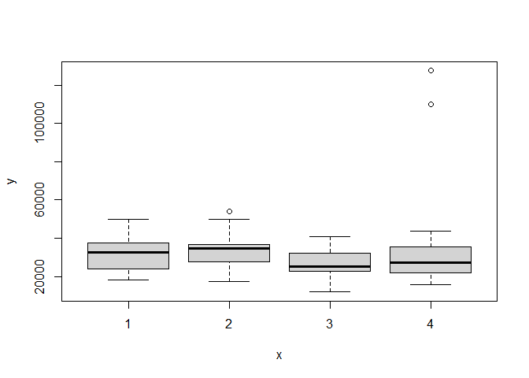<!-- --> Holt
yöntemi trende göre hesaplama yaptığı için biraz daha iyi sonuçlar
verirken trendin hesaplanmasında ağırlık yine son aylar olduğu için
moving average’ın yukarsında hata vermiştir. Moving average da aslında
son ayların ortalaması olduğu için trendi yakalamaya çalışan bir metot
olarak görülebilir. Ayrıca moving average’da belirlediğimiz lag = 4’ de
değiştirilebilir. Bu varsayımlar bu çalışmada örnek olarak
kullanılmışlardır.

Sonuç olarak bu çalışmada R programlama üzerinden veri düzenleme,
ayıklama, temizleme, ön işleme gibi adımlara yer verilmiş daha sonra
problemin amacı olan talep tahmin yöntemleri ile modeller
oluşturulmuştur. Bu modeller hata metriklerine göre değerlendirilmiş
ve karşılaştırılmıştır.
